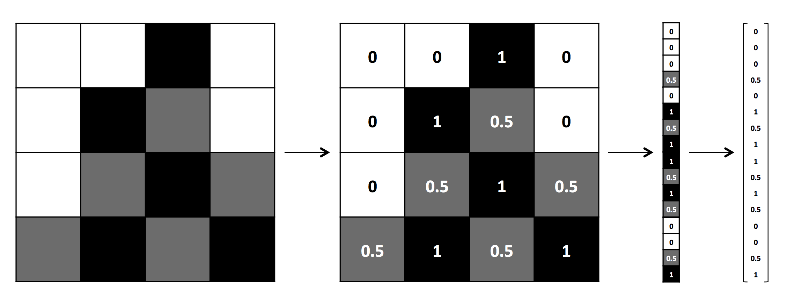
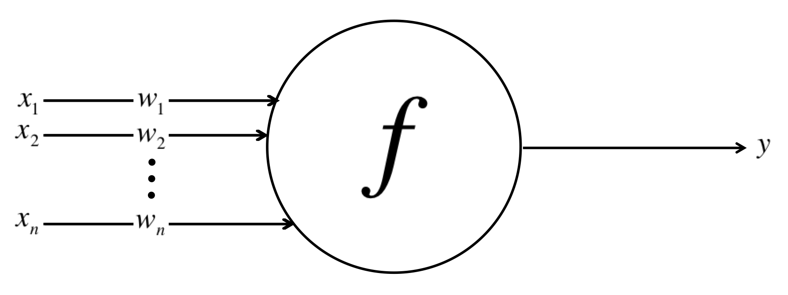
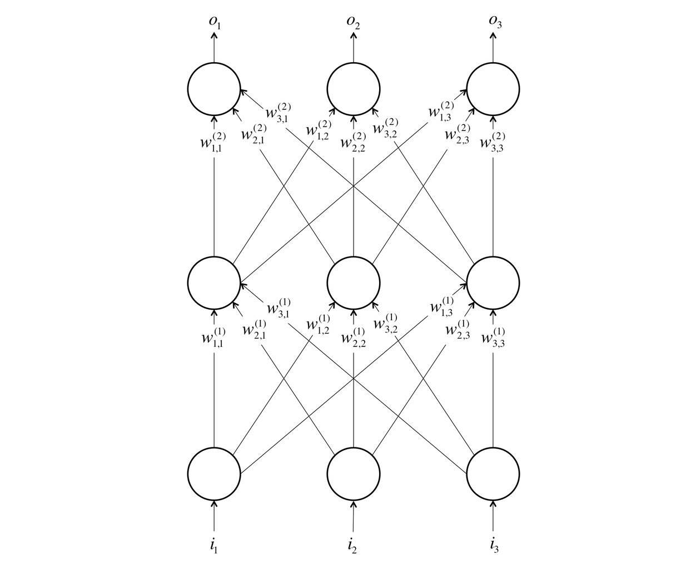

# The Neural Network

## The mechanics of Machine Learning

* Deep learning is a subset of a more general field of artificial intelligence called machine learning, which is predicated on this idea of learning from example. In machine learning, instead of teaching a computer the a massive list rules to solve the problem, we give it a model with which it can evaluate examples and a small set of instructions to modify the model when it makes a mistake. We expect that, over time, a well-suited model would be able to solve the problem extremely accurately.
* Say our model is a function $h(x,\theta)$. The input $x$ is an example expressed in vector form. In this case it is the intensity of the pixel values.



* The input $\theta$ is a vector of the parameters that our model uses. Our machine learning program tries to perfect the values of these parameters as it is exposed to more and more examples.
* Let’s say we wanted to figure out how to predict exam performance based on the number of hours of sleep we get and the number of hours we study the previous day. We collect a lot of data, and for each data point $x = [x_1\  x_2]^T$ we record the number of hours of sleep we got $x_1$, the number of hours we spent studying $x_2$, and whether we performed above average or below the class average. Our goal, then, might be to learn a model $h(x,\theta)$ with parameter vector $\theta = [\theta_0\  \theta_1\  \theta_2]^T$ such that: $h(x,\theta) = \begin{cases}-1 & if\ x^T.\begin{bmatrix}\theta_1 \\\theta_2  \end{bmatrix} + \theta_0 < 0 \\1 & if\ x^T.\begin{bmatrix}\theta_1 \\\theta_2  \end{bmatrix} + \theta_0 \geq 0\end{cases}$
* In other words, we guess that the blueprint for our model $h(x,\theta)$ is as described above. This is nothing but a linar classifier that divides the planes into two halves. We want to learn a parameter vector theta such that our model makes the right predictions (-1 if we perform below average, and 1 otherwise) given an input $x$.  This is model is called a linear perceptron.
* To come up with an optimal value of $\theta$ we need to implement *optimisation*. An optimizer aims to maximize the performance of a machine learning model by iteratively tweaking its parameters until the error is minimized. Learning parameter vectors can be done using certain techniques for instance gradient descent.
* As we move onto much more complex problems such as object recognition and text analysis, our data not only becomes extremely high dimensional, but the relationships we want to capture also become highly nonlinear.

## The neuron

* We can translate this functional understanding of the neurons in our brain into an artificial model that we can represent on our computer.
* Just as in biological neurons, our artificial neuron takes in some number of inputs $x_1,\ x_2, ...x_n$ each of which is multiplied by a specific weight, $w_1,\ w_2,...w_n$. These weighted inputs are, as before, summed together to produce the logit of the neuron, $z = \sum_0^nw_ix_i$. In many cases, the logit also includes a bias, which is a constant. The logit is then passed through a function $f$ to produce the output $y=f(z)$.



* Neuron implementation in python
```
import numpy as np

#####################################################
# Assume inputs and weights are 1-dimensional numpy #
# arrays and bias is a number                       #
#####################################################

class Neuron:
    def __init__(self, weights, bias, function):
        self.weights = weights
        self.bias = bias
        self.function = function

    def forward(self, inputs):
        logit = np.dot(inputs, self.weights) + self.bias
        output = self.function(logit)
        return output
```

## Feed Forward Neural Network

* We need multiple layers of neurons to solve complex tasks. Information is processed and then flows from one layer of neuron to another till we conclude the results. We can construct an artificial neural network. A neural network comes about when we start hooking up neurons to each other, the input data, and to the output nodes, which correspond to the network’s answer to a learning problem.   



* The bottom layer of the network pulls in the input data. The top layer of neurons (output nodes) computes our final answer. The middle layer(s) of neurons are called the hidden layers, and let $w_{ij}^k$ be the weight of the connection between the $i^{th}$ neuron in the $k^{th}$ layer with the $j^{th}$ neuron in the $k+1^{th}$ layer.
* These weights constitute our parameter vector, $\theta$, and just as before, our ability to solve problems with neural networks depends on finding the optimal values to plug into  $\theta$.
* We note that in this example, connections only traverse from a lower layer to a higher layer. There are no connections between neurons in the same layer, and there are no connections that transmit data from a higher layer to a lower layer. These neural networks are called feed-forward networks, and we start by discussing these networks because they are the simplest to analyze.
